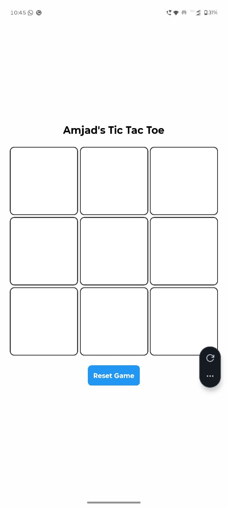

# 🎮 Tic Tac Toe - React Native App

A modern and responsive **Tic Tac Toe mobile application** built using **React Native and Expo**.

This app allows two players to play the classic Tic Tac Toe game with automatic winner detection and draw handling.

---

## 📱 App Preview

### 🟢 Open Game Screen


### 🎮 Play Game Screen


### 🏗️ Android Production Build (AAB Generated)


### 📊 EAS Build Logs


---

## 🚀 Features

- ✅ 3x3 Interactive Game Board
- ✅ Two Player Mode (X vs O)
- ✅ Automatic Winner Detection
- ✅ Draw Detection
- ✅ Reset Game Button
- ✅ Responsive Layout
- ✅ Production AAB Build using EAS

---

## 🛠 Tech Stack

- React Native
- Expo
- EAS Build
- JavaScript (React Hooks)

---

## 🧠 Game Logic

- The board is stored as an array of 9 elements.
- Players alternate turns between X and O.
- Winning combinations checked:
  - Rows
  - Columns
  - Diagonals
- If the board fills and no winner is found → Game ends in a Draw.

---

## ⚙️ Installation & Setup

### 1️⃣ Clone the Repository

```bash
git clone https://github.com/your-username/tic-tac-toe.git
cd tic-tac-toe.  


2️⃣ Install Dependencies
npm install

3️⃣ Run the App
npx expo start

📦 Build for Android (Production AAB)
eas build -p android --profile production


Download the generated .aab file and upload it to Google Play Console.

📂 Project Structure
tic-tac-toe/
│
├── App.js
├── package.json
├── eas.json
├── assets/
│   ├── open-game.jpeg
│   ├── play-game.jpeg
│   ├── android-build.jpeg
│   └── logs.jpeg
└── README.md

🔮 Future Improvements

🤖 AI Single Player Mode

🌐 Online Multiplayer Mode

🏆 Score Tracking System

🎵 Sound Effects

🎨 Improved UI Animations

👨‍💻 Author

Amjad Khan
React Native Developer
